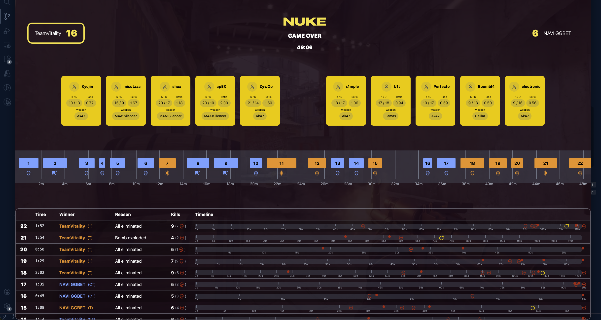

### Key Features & Considerations

1. **Testing Approach**: A limited set of tests were implemented with a focus on rapid development and high confidence in functionality, rather than comprehensive test coverage.

2. **Architecture Trade-offs**: Domain objects should be mapped to data models for database persistence, with separate query handlers mapping data models to the API layer for match reporting. To keep this task fairly within scope, this implementation maps domain objects directly to the API layer without involving DB.

3. **CS:GO Match Support**: The system is designed to support various CS:GO matches, although some enums for map names, weapons, and other game elements may require extension.

4. **Real-time Simulation**: The implementation should be able to handle near real-time behavior by generating log lines incrementally (e.g., 10 lines at a time with intervals between batches).

**Example API Showcase Response:**

```json
{
  "map": "Nuke",
  "startedAt": "2021-11-28T20:41:11",
  "endedAt": "2021-11-28T21:30:17",
  "winnerTeamName": "TeamVitality",
  "totalRounds": 22,
  "duration": 2946,
  "averageRoundDuration": 89.2727272,
  "rounds": [
    {
      "number": 22,
      "startedAt": "2021-11-28T21:28:25",
      "endedAt": "2021-11-28T21:30:17",
      "duration": 112,
      "winner": {
        "teamName": "TeamVitality",
        "side": "Terrorists",
        "reason": "EliminatedAllOpponents"
      },
      "playerSideBySteamId": {
        "STEAM_1:1:60631591": "Terrorists",
        "STEAM_1:1:14739219": "Terrorists",
        "STEAM_1:1:76700232": "Terrorists",
        "STEAM_1:1:22851120": "Terrorists",
        "STEAM_1:0:80477379": "CounterTerrorist",
        "STEAM_1:0:92970669": "CounterTerrorist",
        "STEAM_1:1:36968273": "CounterTerrorist",
        "STEAM_1:1:41889689": "CounterTerrorist",
        "STEAM_1:0:143170874": "CounterTerrorist",
        "STEAM_1:1:23327283": "Terrorists"
      },
      "kills": [
        {
          "killerSteamId": "STEAM_1:1:41889689",
          "victimSteamId": "STEAM_1:1:14739219",
          "timestamp": "2021-11-28T21:29:13",
          "isHeadshot": true,
          "weapon": "M4A1Silencer"
        },
        {
          "killerSteamId": "STEAM_1:0:143170874",
          "victimSteamId": "STEAM_1:1:22851120",
          "timestamp": "2021-11-28T21:30:00",
          "isHeadshot": true,
          "weapon": "Famas"
        }
      ],
      "bombEvents": [
        {
          "playerSteamId": "STEAM_1:1:22851120",
          "action": "Dropped",
          "bombsite": null,
          "timestamp": "2021-11-28T21:30:00"
        },
        {
          "playerSteamId": "STEAM_1:1:76700232",
          "action": "Recieved",
          "bombsite": null,
          "timestamp": "2021-11-28T21:30:08"
        },
        {
          "playerSteamId": "STEAM_1:1:76700232",
          "action": "BeginPlant",
          "bombsite": "B",
          "timestamp": "2021-11-28T21:30:09"
        },
        {
          "playerSteamId": "STEAM_1:1:76700232",
          "action": "Planted",
          "bombsite": "B",
          "timestamp": "2021-11-28T21:30:12"
        }
      ]
    }
  ],
  "teams": [
    {
      "name": "TeamVitality",
      "kills": 86,
      "deaths": 63,
      "playerSteamIds": [
        "STEAM_1:1:60631591",
        "STEAM_1:1:14739219",
        "STEAM_1:1:76700232",
        "STEAM_1:1:22851120",
        "STEAM_1:1:23327283"
      ],
      "kd": 1.3650793650793651
    },
    {
      "name": "NAVI GGBET",
      "kills": 63,
      "deaths": 86,
      "playerSteamIds": [
        "STEAM_1:0:80477379",
        "STEAM_1:0:92970669",
        "STEAM_1:1:36968273",
        "STEAM_1:1:41889689",
        "STEAM_1:0:143170874"
      ],
      "kd": 0.7325581395348837
    }
  ],
  "players": [
    {
      "steamId": "STEAM_1:1:60631591",
      "name": "misutaaa",
      "teamName": "TeamVitality",
      "kills": 15,
      "deaths": 9,
      "weaponWithMostKills": "M4A1Silencer",
      "kd": 1.6666666666666667
    }
  ],
  "weaponStats": [
    {
      "weaponName": "UspSilencer",
      "kills": 7,
      "headshots": 5
    },
    {
      "weaponName": "Glock",
      "kills": 3,
      "headshots": 3
    }
  ]
}
```
